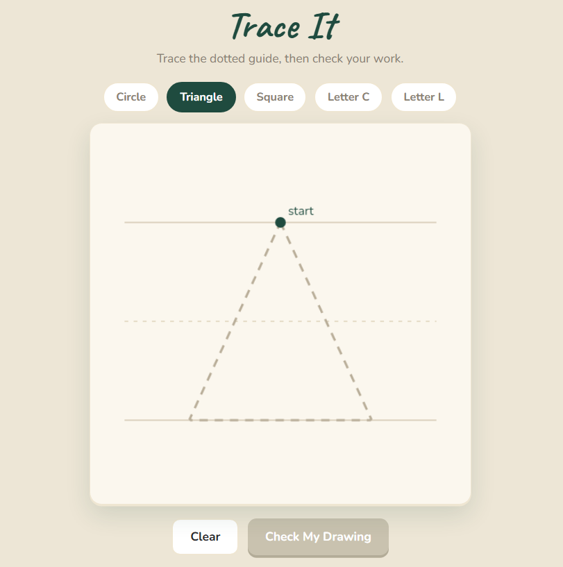
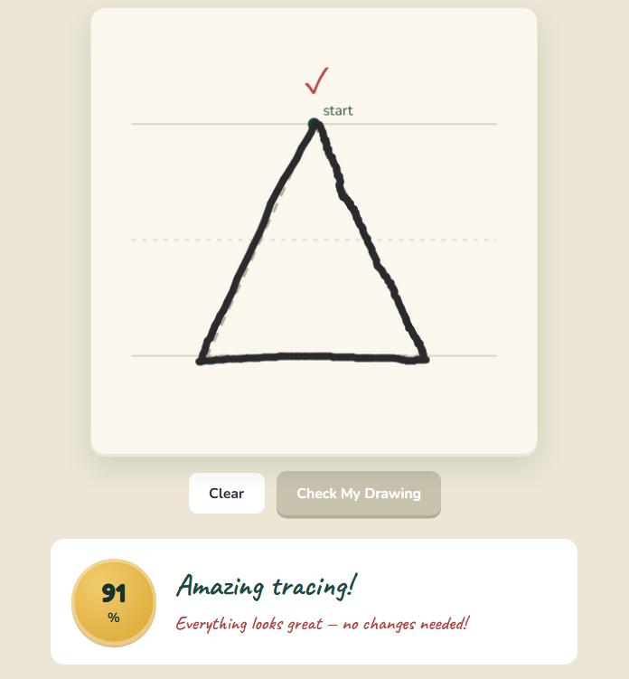
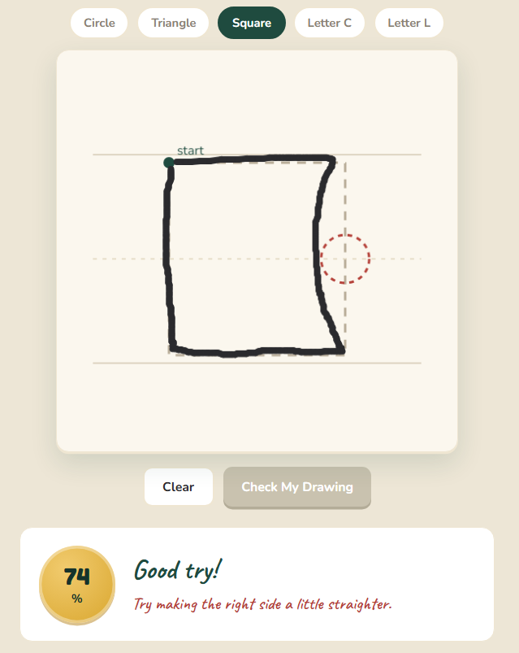

# Trace It — Production Track

A browser-based tracing evaluation tool for children. The child draws a letter/shape, and the system analyzes the drawing using nearest-neighbor (Chamfer distance) matching, provides a score (0–100%), and gives per-segment feedback.

## Project structure

```
CV Prototype/
├── src/
│   ├── main.jsx         # React entry point
│   ├── App.jsx          # Main component
│   ├── geometry.js      # Shape definitions
│   ├── scoring.js       # Scoring + feedback
│   ├── canvas.js        # Canvas drawing utilities
│   └── index.css        # All styles
├── public/
├── index.html
├── vite.config.js
├── package.json
└── README.md
```

## Quick start

```bash
npm install
npm run dev
```

UI → `http://localhost:5173`

## How to use

1. Open the frontend — pick a shape, then draw with your mouse.
2. Click **Check My Drawing** — analysis runs in the browser.
3. See your **score** (gold badge), **headline**, and actionable **tips**.
4. Problem areas are circled in **red** on the canvas.

Shapes: `circle`, `triangle`, `square`, `letterC`, `letterL`.

## License

[MIT](LICENSE)

## Screenshots


*Pick a shape and trace over the dotted guide.*


*Score badge, headline, and per-segment improvement tips.*


*Problem segments circled in red on the canvas.*

